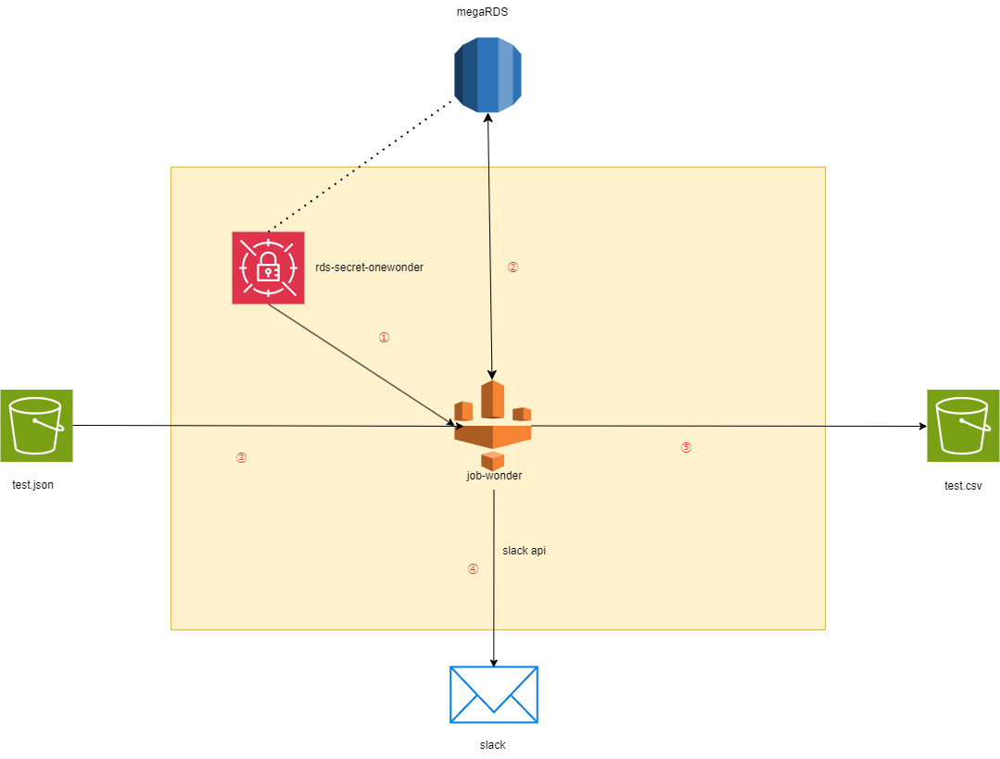

- [OneWonder](https://www.onewonder.co.jp/) はクラウドコンピューティングに特化したサービスを提供しています
## 使用技術一覧


## アーキテクチャ図
- [glue.drawio](docs)


# GLue逻辑处理流程
- [gule_test_job.py]
```mermaid
flowchart TD
    A[初始化 Spark/Glue 上下文] --> B[获取任务参数]
    B --> C[从 AWS Secrets Manager 获取数据库凭证]
    C --> D[从 S3 读取 JSON 数据]
    D -->|成功| F[从 RDS 读取数据]
    D -->|失败| E[发送错误通知到 Slack 并退出]
    F -->|成功| G[验证两个数据源都有 id 列]
    F -->|失败| E
    G -->|验证通过| H[获取所有可能的列]
    G -->|验证失败| E
    H --> I[收集 S3 数据中的所有 ID]
    I --> J[遍历处理 S3 数据]
    J --> K[找到匹配] & M[未找到匹配]
    K -->|找到匹配| L[合并数据: 优先使用 S3 值，缺失时使用 RDS 值]
    K -->|未找到匹配| M[只使用 S3 数据]
    L --> N[新加到结果集]
    M --> N
    N --> O[创建最终 DataFrame 并保持列顺序]
    O --> P[查找 RDS 中有但 S3 中没有的记录]
    P --> Q[有未匹配记录?]
    Q -->|是| R[发送未匹配记录信息到 Slack]
    Q -->|否| S[将结果写入 CSV]
    R --> S
    S -->|成功| T[发送成功通知到 Slack]
    S -->|失败| E
    T --> U[完成作业]