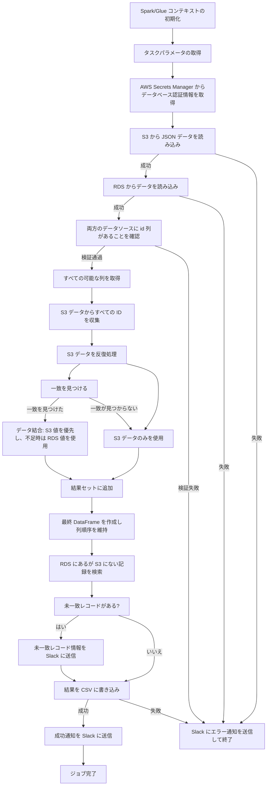

- [OneWonder](https://next.onewonder.co.jp/) はクラウドコンピューティングに特化したサービスを提供しています

## 使用技術一覧

## プロジェクト名

rds-glue-s3-etl-pipeline

## プロジェクト概要

本プロジェクトは AWS Glue（PySpark）をデータ処理エンジンとして活用し、AWS Secrets Manager でデータベース認証情報を安全に管理しています。また、Webhook 経由で Slack 通知機能を統合し、完全な自動データ処理と監視フローを実現しています。このアーキテクチャは、JSON データとリレーショナルデータベースのデータを定期的に統合し、特定の形式を維持する必要があるシナリオに最適です。

## アーキテクチャ図

- [glue.drawio](docs)

### 処理フロー

① **データセキュリティ**: シークレットマネージャー（rds-secret-onewonder）からデータベース認証情報を取得し、中央の job-wonder 処理コンポーネントに渡します。 
② **データベース接続**: 取得した認証情報を使用して上部の megaRDS データベースに接続し、データを読み取ります。 
③ **入力データ取得**: 左側の S3 バケットから test.json ファイルを入力データソースとして読み取ります。 
④ **状態通知**: 下部に接続されている Slack API を通じて、処理状態と結果通知を Slack に送信します。 
⑤ **出力データ保存**: 処理完了後、結果データを test.csv 形式で右側の S3 バケットに出力します。 

全体のプロセスは黄色の枠（Terraform 化にする）内で実行され、中心の Glue(job-wonder)がすべてのデータフローと変換操作を調整・処理します。

# GLue 逻辑处理流程

- [gule_test_job.py](gule_test_job.py)

#### 連絡先
蔡：inje.sai@onewonder.co.jp 

王：xingran.wang@onewonder.co.jp

#### SlackApiについて
もしslackapiがパブリックリポジトリにコミットしたら無効になれます。